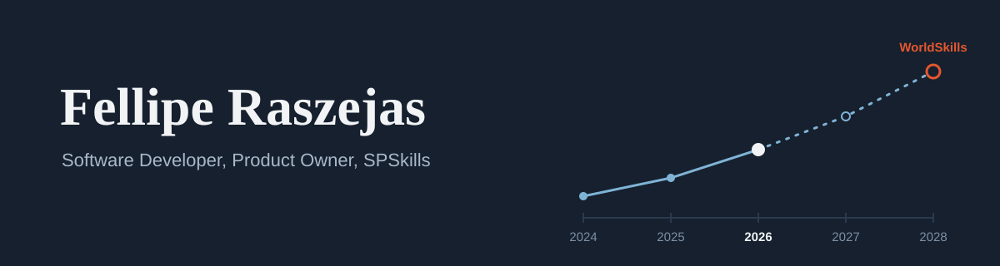
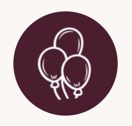
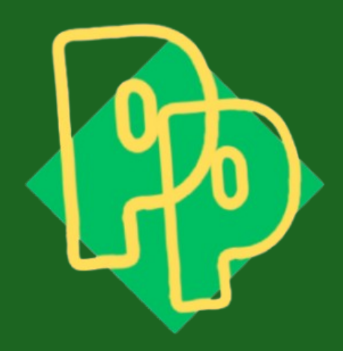

Desenvolvo software e conduzo produtos digitais, com foco em soluções educacionais e projetos de impacto. Hoje divido meu tempo entre a entrega técnica, a visão de produto e a preparação para competições de educação profissional.

## Sobre mim

**Formação**
Técnico em Desenvolvimento de Sistemas, SENAI Gaspar Ricardo Junior (Itapetininga).
Tecnólogo em Análise e Desenvolvimento de Sistemas, SENAI Gaspar Ricardo Junior (Sorocaba).

**Product Owner**
Na Plataforma Unisenai Sorocaba, defino prioridades e conduzo a evolução do produto, conectando o que a instituição precisa divulgar ao que a equipe consegue entregar.

**SPSkills**
Treino para as competições SPSkills representando o SENAI Sorocaba na etapa estadual, com a meta de chegar à WorldSkills em 2028.

## Atualmente

**Plataforma Unisenai**
Plataforma que centraliza e divulga os Projetos Integradores e os Projetos de Extensão do SENAI Sorocaba. Lidero o produto e as próximas atualizações.

**Preparação para a WorldSkills**
Ciclo de treinamento e competições, da etapa estadual rumo à etapa internacional.

## Projetos

**[GastroMatch](https://github.com/GastroMatch-PI)**
Em desenvolvimento ativo. Conecta usuários e estabelecimentos a partir da experiência gastronômica.

**Projetos anteriores**

<table>
  <tr>
    <td align="center" width="160">
       
      <a href="https://github.com/fleiper/palmer_next">Palmer</a>
    </td>
    <td align="center" width="160">
       
      N-CASH
    </td>
    <td align="center" width="160">
       
      EverMynd (antes TWB)
    </td>
    <td align="center" width="160">
       
      País da Palavra
    </td>
  </tr>
</table>

## Tecnologias

<table>
  <tr>
    <td>Back-end</td>
    <td></td>
  </tr>
  <tr>
    <td>Front-end</td>
    <td></td>
  </tr>
  <tr>
    <td>Mobile</td>
    <td></td>
  </tr>
  <tr>
    <td>Infraestrutura e ferramentas</td>
    <td></td>
  </tr>
</table>

## Trajetória

| Ano | Marco |
| --- | --- |
| 2024 | Ingresso no mundo digital. |
| 2025 | Desenvolvimento do Palmer, sistema de gerenciamento de faculdade. |
| 2026 | SPSkills, Product Owner da Plataforma Unisenai. Desenvolvimento do GastroMatch. |
| 2027 | Meta: Graduação com excelência |
| 2028 | Meta: representar o Brasil na WorldSkills. |

## Princípios

- Entender o problema antes de escolher a solução.
- Produto e código evoluem juntos, e um precisa respeitar o outro.
- Entregar em ciclos curtos, com clareza sobre o que vem depois.

## Contato

<table>
  <tr>
    <td></td>
    <td><a href="mailto:oliveiraraszejasfellipe@gmail.com">oliveiraraszejasfellipe@gmail.com</a></td>
  </tr>
  <tr>
    <td></td>
    <td><a href="https://www.linkedin.com/in/fellipe-raszejas-6852a0313/">linkedin.com/in/fellipe-raszejas-6852a0313</a></td>
  </tr>
  <tr>
    <td></td>
    <td>Organização atual: <a href="https://github.com/GastroMatch-PI">GastroMatch-PI</a></td>
  </tr>
</table>
 
